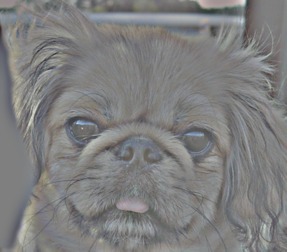

# 楊承翰
# Project 1 / Image Filtering and Hybrid Images
## Overview
This project implement correlation and use it to create hybrid images.

## Implementation
### correlattion
1. version 1
    * Just do convolution literally.
Since the memory allocation is dispersed and fragmented, this method is supposed to be slow.
```
output = np.zeros_like(image)
row = imfilter.shape[0];
clm = imfilter.shape[1];
image_pad = pad(image, imfilter.shape, 'reflect');
for i in range(image.shape[0]):
    for j in range(image.shape[1]):
        for ch in range(image.shape[2]):
            output[i,j,ch] = np.sum(image_pad[i:i+row,j:j+clm,ch] * imfilter)
```
2. version 2
    * Allocating memory with bigger size and fewer times is more efficient than allocating memory with smaller size many times.
Since the picture size is larger than filter size in most of time, swap the iteration order can improve the performance significantly.
```
duplic = np.zeros((image.shape[0], image.shape[1], image.shape[2], imfilter.shape[0] * imfilter.shape[1]))
for i in range(imfilter.shape[0]):
    for j in range(imfilter.shape[1]):
        duplic[:, :, :, i*imfilter.shape[1] + j] = pad2(image, imfilter.shape, i, j) * imfilter[i, j]
output = np.sum(duplic, axis = 3)
```

3. version 3
    * The result of `duplic[:, :, :, i*imfilter.shape[1] + j]` will be summed into `output_v3[:,:,:]`. 
It's unnecessary to allocate memory for each of them.
For filter with larger size, this method can improve the performance significantly.

```
output = np.zeros_like(image)
for i in range(imfilter.shape[0]):
    for j in range(imfilter.shape[1]):
        output += pad2(image, imfilter.shape, i, j, 'reflect') * imfilter[i, j]
```

| filter size | reference time | v1 time | v2 time | v3 time |
|:---:|:---:|:---:|:---:|:---:|
| 3x3 | 0.002s | 1.226s | 0.033s | 0.006s |
| 25x25 | 0.173s | 1.598s | 2.698s | 0.113s |

### pading

The code of pad2 is showed below. It's dedicate designed for version 3 my_imfilter. Input `image ` is the image that need to be padded. 
 Input `shape` means filter shape. Inputs `i, j` present current position of filter. `mode` default value is reflect and will use zero padding if `mode` != reflect.
```
def pad2(image, shape, i, j,  mode = 'reflect'):
    image_new = np.zeros_like(image)
    row_begin = max([i - shape[0]//2, 0])
    clm_begin = max([j - shape[1]//2, 0])
    
    row_end = image.shape[0] - max([shape[0]//2 - i, 0])
    clm_end = image.shape[1] - max([shape[1]//2 - j, 0])
    
    row_begin2 = max([shape[0]//2 - i, 0])
    clm_begin2 = max([shape[0]//2 - j, 0])
    
    row_end2 = image.shape[0] - max([i - shape[0]//2, 0])
    clm_end2 = image.shape[1] - max([j - shape[1]//2, 0])
    
    image_new[row_begin2:row_end2, clm_begin2:clm_end2, :] = image[row_begin:row_end, clm_begin:clm_end, :]
    if(mode == 'reflect'):
        if(i < shape[0]//2):
            image_new[:row_begin2, clm_begin2:clm_end2, :] = image[row_begin2-1::-1, clm_begin:clm_end,:]

        elif(i > shape[1]//2):
            image_new[row_end2:, clm_begin2:clm_end2, :] = image[:row_end2-1:-1, clm_begin:clm_end,:]

        if(j < shape[1]//2):
            image_new[:, :clm_begin2, :] = image_new[:, clm_begin2*2 - 1:clm_begin2 - 1:-1, :]
        elif(j > shape[1]//2):
            image_new[:, clm_end2:, :] = image_new[:, clm_end2 - 1:clm_end2-(j - shape[1]//2) - 1:-1, :]
        
    
    return image_new
```
This part do the reflection of top and bottom part of image padding.
```
        if(i < shape[0]//2):
            image_new[:row_begin2, clm_begin2:clm_end2, :] = image[row_begin2-1::-1, clm_begin:clm_end,:]

        elif(i > shape[1]//2):
            image_new[row_end2:, clm_begin2:clm_end2, :] = image[:row_end2-1:-1, clm_begin:clm_end,:]
```


This part do the reflection of left and right part of image padding. Note that it reflect from `image_new` to get the corner part of image padding.
```
        if(j < shape[1]//2):
            image_new[:, :clm_begin2, :] = image_new[:, clm_begin2*2 - 1:clm_begin2 - 1:-1, :]
        elif(j > shape[1]//2):
            image_new[:, clm_end2:, :] = image_new[:, clm_end2 - 1:clm_end2-(j - shape[1]//2) - 1:-1, :]
```

### Hybrid Images
Remove the high frequencies from image1
```
low_frequencies = my_imfilter(image1, gaussian_filter)
```

Remove the high frequencies from image1
```
pulse = np.zeros_like(gaussian_filter)
pulse[cutoff_frequency*2 + 1,cutoff_frequency*2 + 1] = 1
high_frequencies = my_imfilter(image2, pulse - gaussian_filter)
```
Combine the high frequencies and low frequencies. Normalize is for insurance that value is between one to zero, and it's also insurance contrast 
```
hybrid_image = normalize(high_frequencies + low_frequencies)
```

## Installation
* numpy 
* matplotlib (show and save result)
* scipy (Just used in proj1_test_filtering.py for image resizing to reduce run time)

## Results

<table border=1>
<tr>
<td>


</td>
</tr>

<tr>
<td>




</td>
</tr>

<tr>
<td>


</td>
</tr>

<tr>
<td>


</td>
</tr>

<tr>
<td>


</td>
</tr>

<tr>
<td>


</td>
</tr>

<tr>
<td>


</td>
</tr>

<tr>
<td>


</td>
</tr>

<tr>
<td>


</td>
</tr>

<tr>
<td>


</td>
</tr>


