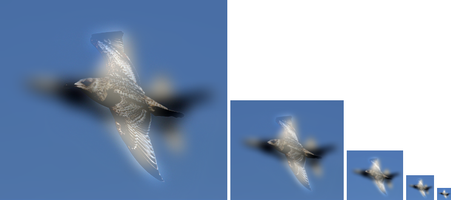

# 楊承翰
# Project 1 / Image Filtering and Hybrid Images
## Overview
## Implementation
### Convolution
1. version 1
    * Just do convolution literally.
Since the memory allocation is dispersed and fragmented, this method is supposed to be slow.
```
output = np.zeros_like(image)
row = imfilter.shape[0];
clm = imfilter.shape[1];
image_pad = pad(image, imfilter.shape, 'reflect');
for i in range(image.shape[0]):
    for j in range(image.shape[1]):
        for ch in range(image.shape[2]):
            output[i,j,ch] = np.sum(image_pad[i:i+row,j:j+clm,ch] * imfilter)
```
2. version 2
    * Allocating memory with bigger size and fewer times is more efficient than allocating memory with smaller size many times.
Since the picture size is larger than filter size in most of time, swap the iteration order can improve the performance significantly.
```
duplic = np.zeros((image.shape[0], image.shape[1], image.shape[2], imfilter.shape[0] * imfilter.shape[1]))
for i in range(imfilter.shape[0]):
    for j in range(imfilter.shape[1]):
        duplic[:, :, :, i*imfilter.shape[1] + j] = pad2(image, imfilter.shape, i, j) * imfilter[i, j]
output = np.sum(duplic, axis = 3)
```

3. version 3
    * The result of `duplic[:, :, :, i*imfilter.shape[1] + j]` will be summed into `output_v3[:,:,:]`. 
It's unnecessary to allocate memory for each of them.
For filter with larger size, this method can improve the performance significantly.

```
output = np.zeros_like(image)
for i in range(imfilter.shape[0]):
    for j in range(imfilter.shape[1]):
        output += pad2(image, imfilter.shape, i, j, 'reflect') * imfilter[i, j]
```

| filter size | reference time | v1 time | v2 time | v3 time |
|:---:|:---:|:---:|:---:|:---:|
| 3x3 | 0.002s | 1.226s | 0.033s | 0.006s |
| 25x25 | 0.173s | 1.598s | 2.698s | 0.113s |

## Installation
* numpy 
* matplotlib (show and save result)
* scipy (Just used in proj1_test_filtering.py for image resizing to reduce run time)

## Results

<table border=1>
<tr>
<td>


</td>
</tr>

<tr>
<td>


</td>
</tr>

<tr>
<td>


</td>
</tr>

<tr>
<td>



</td>
</tr>

<tr>
<td>


</td>
</tr>

<tr>
<td>


</td>
</tr>

<tr>
<td>


</td>
</tr>

<tr>
<td>


</td>
</tr>

<tr>
<td>


</td>
</tr>

<tr>
<td>


</td>
</tr>


